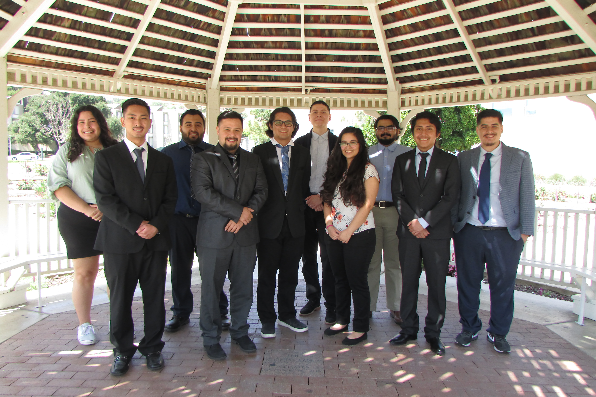

Developed two conceptual spacecraft architectures with teammates that will travel
to Mars’ moons to collect samples.
Continuously referenced given request for proposal to ensure requirements were
being met.
Conducted independent technical research on spacecraft subsystems and similar
payload instruments.
Calculated best subsystem options using trade studies.
Learned how to use NASA’s PCEC program to find preliminary cost estimation.
Wrote a formal SRR, SDR, and PDR with teammates and presented them to various
boards of engineers for review.
Implemented feedback to update and optimize spacecraft design.

My Senior Design group:

