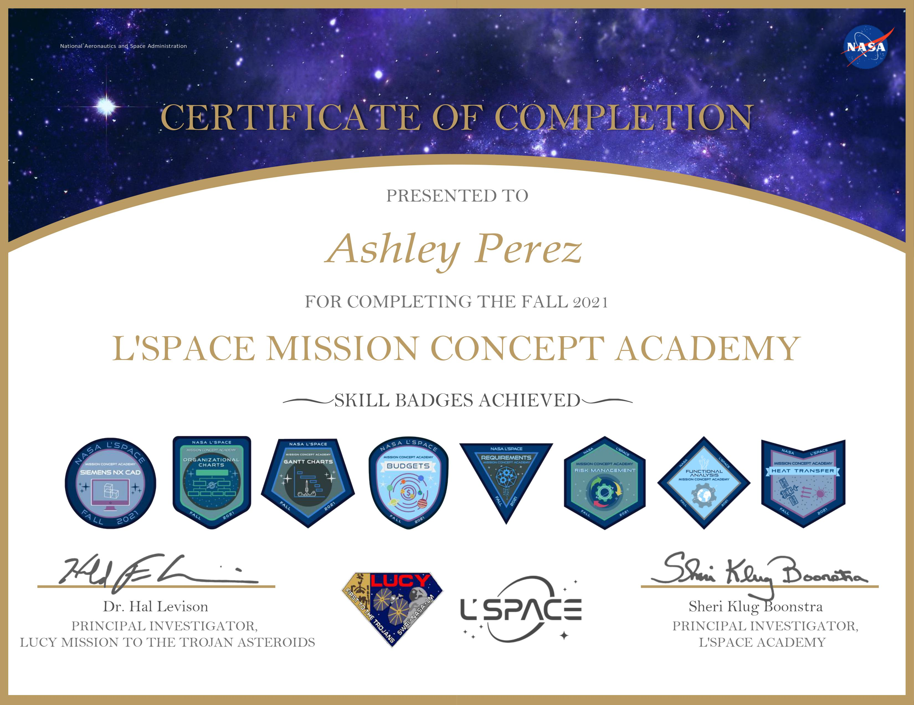

During my time in NASA's Mission Concept Academy, I refined my technical writing skills by working with a multidisciplinary team to deliver a Preliminary Design Review (PDR). This PDR discusses a proposed mission that will locate and analyze possible ice locations on Mars. I was responsible for finding a suitable landing location, and I did this using Java Mission-planning and Analysis for Remote Sensing (JMARS). This program allowed me to see the elevation change in a set area, and I found a relatively flat landing area that was in the location of debris-covered glaciers.

You can find a PDF version of our PDR by clicking [[here]](MCAPDR.pdf)

Here is my certification of completion:
  
