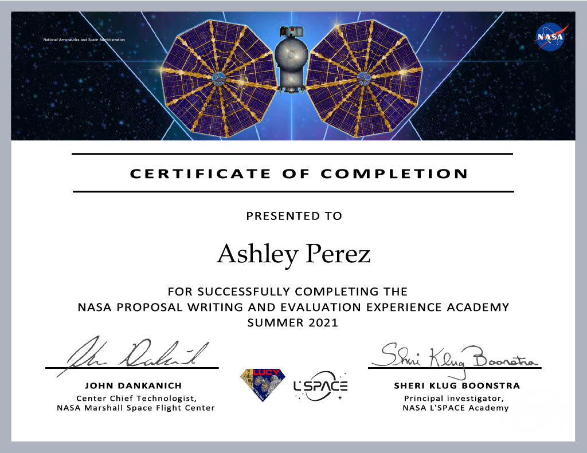

During my time in NASA's Proposal Writing and Evaluation Experience, I was introduced to proposals, quad charts, and new technology reports for the first time. I collaborated with an interdisciplinary team to write a technical proposal on mycelium for structural use. More specifically, we proposed that it would be possible to use it for manned planetary missions as construction material for housing. Once submitted, I learned how analyze and grade proposals following a review process led by an industry professional. Overall, this project showed me what I should expect when writing and grading a proposal in the aerospace industry and was a stepping stone for my experience in technical writing.

You can find a PDF version of our Proposal by clicking [[here]](NPWEEProposal.pdf)

Here is my certification of completion:
  

