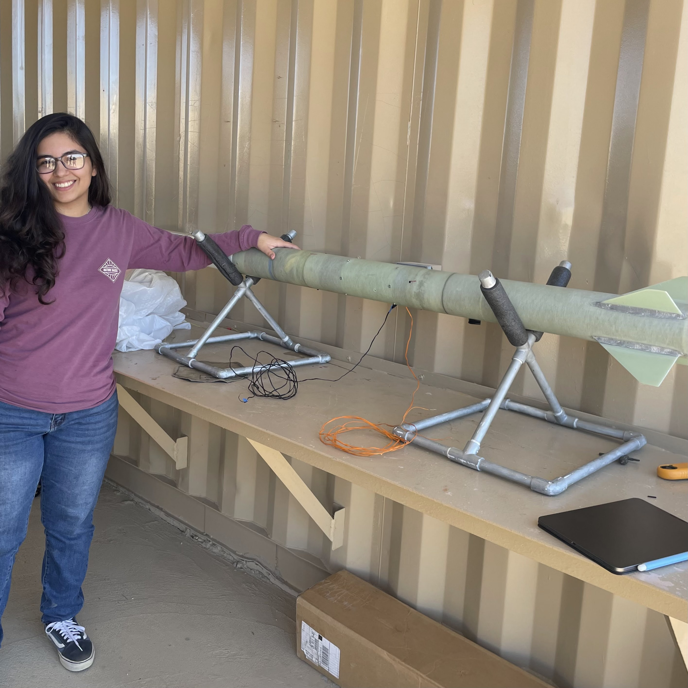
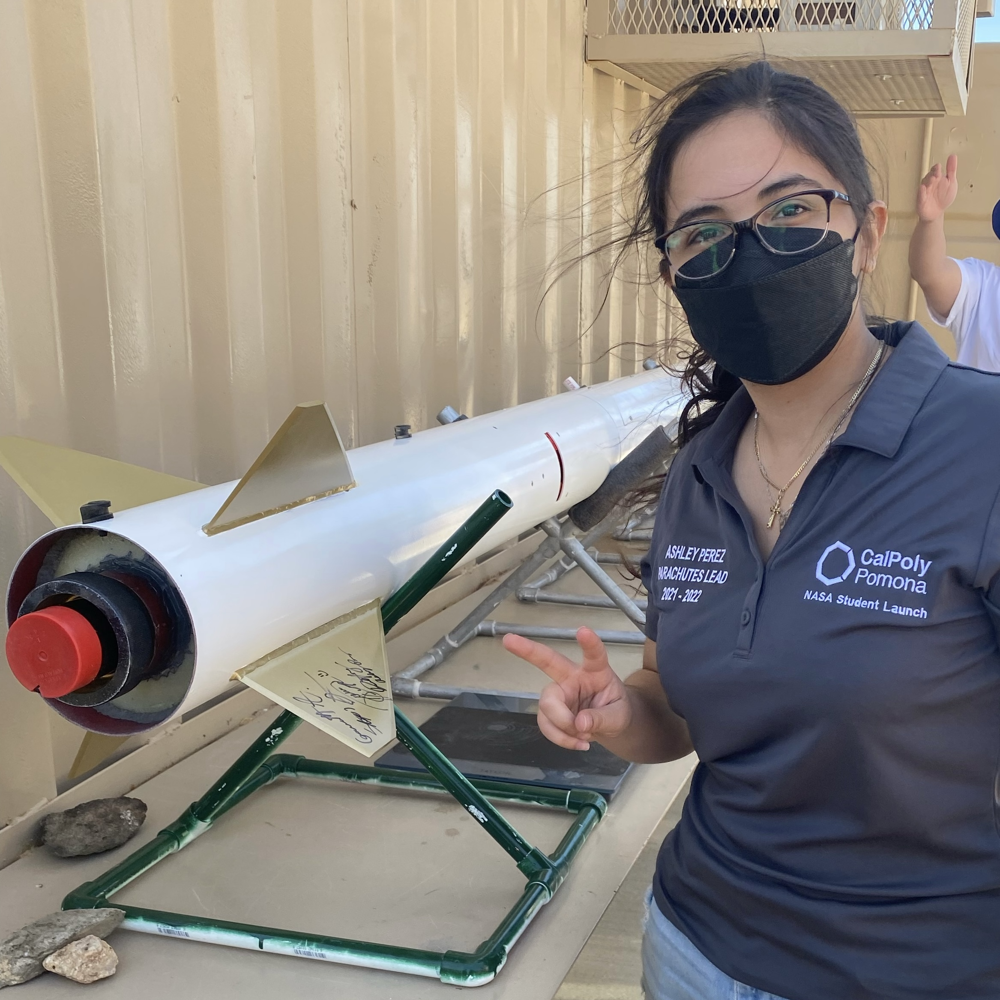

During my time in NASA Student Launch, I strengthened my capabilities in analysis by conducting trade studies and troubleshooting using a MATLAB live script. I also gained more experience with writing technical reports; we wrote and submitted a proposal, a Preliminary Design Review (PDR), a Critical Design Review (CDR), a Flight Readiness Review (FRR), and a Post Launch Assessment Review (PLAR).

You can find a PDF version of our PDR by clicking [[here]](NSLPDR.md)

including a keen attention to detail and accuracy. 
I have a well-rounded skill set in technical writing and experience in collaborative group projects
shaped me into an effective communicator with plenty of experience in technical writing. 
