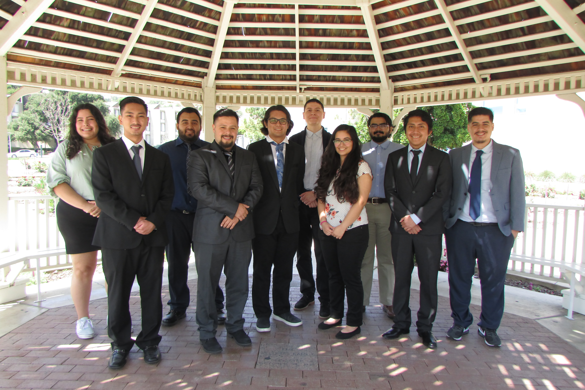

Space Vehicle and Design Laboratory was my senior design class at Cal Poly Pomona. My group chose to answer American Institute of Aeronautics and Astronautics' (AIAA) Request for Proposal (RFP). We designed a manned spacecraft that would travel to the Martian moons of Phobos and Deimos to collect samples. I was the payload lead, so I conducted research on similar mission payload instruments to base our spacecraft on. I was also the cost analysis lead, so I taught myself how to use NASA's Project Cost Estimating Capability (PCEC) program by doing independent research. Throughout the school year, my team and I created a System Requirements Review (SRR), System Definition Review (SDR), and Preliminary Design Review (PDR), along with various presentations.

You can find a PDF version of our final report by clicking [[here]](SDReport.pdf)

My Senior Design group:

[Back to project list](https://isstaylor.github.io/Projects/)
